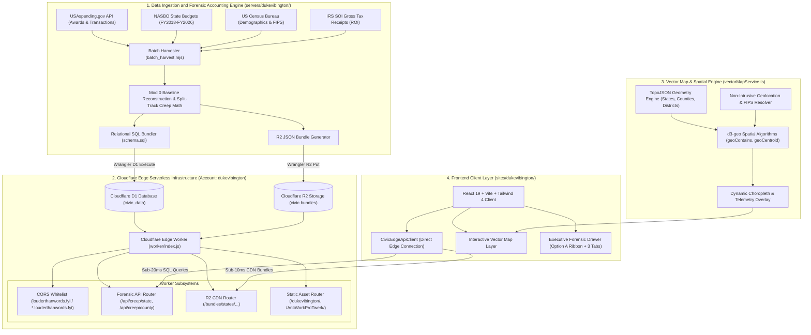
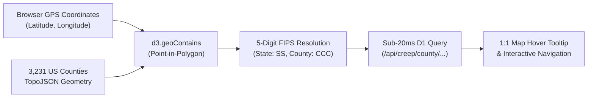

# Civic Intelligence Platform — High-Level System Architecture

## 1. Executive Summary

The **Civic Intelligence Platform** (`louderthanwords.fyi`) is a globally distributed, high-speed forensic procurement accounting system designed to analyze and expose federal contract creep, corporate monopolies, and bureaucratic budget escalation across all 50 U.S. states and ~3,100 counties.

By pre-computing Mod #0 contract baselines and deploying relational datasets directly to Cloudflare's edge network (**D1 SQL Database** & **R2 Object Storage**), the platform delivers sub-20ms queries while running at **\$0.00 operational cost**.

---

## 2. System Architecture Diagram



---

## 3. Core Architecture Components

### A. Data Ingestion & Forensic Math Pipeline (`servers/dukevibington/`)
- **Baseline Reconstruction**: Rather than using naive `Award Amount` aggregates, the pipeline queries the complete transaction ledger for every contract, extracting **Modification #0** as the true initial obligation and tracking all subsequent cost escalations.
- **Split-Track IDV vs. Definitive Logic**:
  - **Definitive Contracts**: Tracks growth against initial funded baseline.
  - **Indefinite Delivery Vehicles (IDVs)**: Tracks cumulative task order obligations against authorized potential ceiling caps.
- **Benchmark Enrichment**: Blends NASBO annual state operating budgets, IRS gross tax collections, and US Census demographics to compute:
  - *Return on Tax Dollar* (Federal awards returned per dollar of IRS tax paid).
  - *Contracts-to-Budget Ratio* (Federal procurement footprint relative to state expenditures).
  - *Per-Capita Overrun Burden*.

### B. Cloudflare Edge Data Server
- **Cloudflare D1 SQL Database (`civic_data`)**:
  - `jurisdictions`: State and county aggregate metrics, per-capita figures, and top offenders.
  - `awards`: Top audited prime awards with pre-calculated dollar creep, percent creep, pricing risk, and transaction history.
  - `jurisdiction_fiscal_years`: Annual time-series cohorts (FY2018–FY2026) for longitudinal trend analysis.
  - `civic_cache`: Dynamic edge key-value cache fallback.
- **Cloudflare R2 Object Storage (`civic-bundles`)**:
  - Stores complete JSON state bundles (`dukevibington/states/[STATE].json`) for instant full-state hydration.
- **Cloudflare Edge Worker (`worker/index.js`)**:
  - Executes API endpoints with global Anycast routing.
  - Enforces strict Origin whitelist (`louderthanwords.fyi`, `*.louderthanwords.fyi`, `localhost`).
  - Sets security headers (`X-Content-Type-Options: nosniff`, `X-Frame-Options: SAMEORIGIN`).

### C. Client Application (`sites/dukevibington/`)
- **Option A ("The Executive Ribbon")**:
  - **Ultra-Compact Header**: Minimal height (~32px) preserving vertical space.
  - **1-Row 4-Metric Ribbon**: Displays `Initial Baseline`, `Current Total`, `Dollar Creep` (`+$X.XXM`), and `Percent Creep` (`+X.X%`).
  - **Secondary Badge Strip**: `Top Offender`, `Cost-Plus Exposure %`, and `Capital Flight %`.
  - **Unified Tabs & Search**: Single row containing the 3 investigative tabs (*The Overruns*, *The Monopolies*, *The Bureaucrats*) and search filter.
  - **List Container**: Expands to occupy **>72% of drawer height** for maximum data density.
- **Pure Plus Jakarta Sans Typography**: Geometric numerals with tabular alignment (`tabular-nums`) and clean borders.

---

## 4. Vector Map & Spatial Intelligence Engine (`vectorMapService.ts`)

The vector mapping system provides a multi-resolution, interactive spatial visualization of procurement data across the United States.



### 1. Multi-Resolution TopoJSON Geometry Pipeline
- **Topology Decoding**: Utilizes `topojson-client` to decode shared boundary arcs, reducing raw GeoJSON payload sizes by over **80%**.
- **Hierarchical Geometry Layers**:
  - **National Layer (`states-10m.json`)**: 50 US States + DC + Puerto Rico.
  - **County Layer (`counties-10m.json`)**: All 3,231 US county boundaries indexed by 5-digit Federal Information Processing Standard (FIPS) codes (`SSCCC`).
  - **Congressional Districts**: 435 voting districts for federal representative auditing.
  - **Municipal Boundaries**: Topological subdivisions for city, village, and township granularity.

### 2. Spatial Algorithms & Topological Calculations (`d3-geo`)
- **Topological Point-in-Polygon (`d3.geoContains`)**:
  - Executes ray-casting and spherical boundary polygon tests to match any arbitrary GPS coordinate `[lng, lat]` to its exact containing county in **<5ms**.
- **Centroid & Bounding Proximity (`d3.geoCentroid`)**:
  - Calculates geographic centroids for camera recentering, smooth vector panning, and proximity fallbacks for complex coastal/island geographies.
- **Area Normalization (`d3.geoArea`)**:
  - Determines spherical surface area for intelligent map zoom fitting.

### 3. Dynamic Choropleth & Telemetry Heatmap Engine
- Polygons are dynamically shaded based on forensic financial metrics:
  - **Dollar Creep Intensity**: Net taxpayer cost escalation ($0 to +$100M+).
  - **Percent Creep**: Proportion of budget overrun relative to Mod #0 baseline.
  - **Per-Capita Overrun Burden**: Total dollars overspent per local resident.
- **1:1 Tooltip Parity**: Hovering any polygon renders the exact 4-metric ledger (`Initial Baseline`, `Current Total`, `Dollar Creep`, `Percent Creep`), maintaining character-for-character metric consistency with the drawer ledger.

### 4. Non-Intrusive Geolocation System
- **Autonomous Detection**: On initial page load, `navigator.geolocation` queries user coordinates and runs `reverseGeolocate(lat, lng)`.
- **Zero Disruptive Auto-Zoom**: The user's location is stored silently in state without jarring the camera away from the national overview.
- **Interactive Action Pill**: Displays a sleek breadcrumb badge:
  `📍 Go to My Jurisdiction (County Name, State)`
  allowing the user to fly smoothly to their home county on their own terms.

---

## 5. Operational & Free-Tier Scaling Metrics

| Service | Cloudflare Free Allowance | Civic Intelligence Platform Usage | Cost |
|---|---|---|---|
| **Cloudflare D1 Database** | 5,000,000 reads / day | Pre-indexed sub-query lookups (~1 read/jur) | **\$0.00** |
| **Cloudflare R2 Storage** | 10,000,000 ops / mo | Zero-egress pre-computed JSON bundles | **\$0.00** |
| **Cloudflare Workers** | 100,000 requests / day | Sub-4ms CPU execution time | **\$0.00** |
| **Bandwidth / Egress** | Unlimited (\$0 egress fees) | Global CDN edge caching | **\$0.00** |

---

## 6. Directory Structure & Key Files

```
louderThanWords/
├── servers/
│   └── dukevibington/
│       ├── batch_harvest.mjs      # Multi-state automated batch crawler
│       ├── ingest.mjs             # Ingestion & Mod #0 creep engine
│       ├── schema.sql             # D1 relational schema
│       ├── data/                  # NASBO benchmarks & Census cohorts
│       ├── bundles/               # Pre-computed R2 state JSON payloads
│       └── ARCHITECTURE.md        # This high-level architecture document
├── worker/
│   └── index.js                   # Cloudflare Edge Worker router & security
├── sites/
│   └── dukevibington/
│       ├── src/
│       │   ├── App.tsx            # Main layout, map, and telemetry
│       │   ├── components/
│       │   │   └── ContractCreepPanel.tsx  # Option A Executive Ribbon drawer
│       │   └── services/
│       │       ├── vectorMapService.ts     # TopoJSON map & spatial engine
│       │       ├── civicEdgeApiClient.ts   # Edge D1/R2 API client
│       │       └── civicCacheService.ts    # Multi-tier memory/session cache
└── wrangler.jsonc                 # Cloudflare D1 & R2 resource bindings
```
